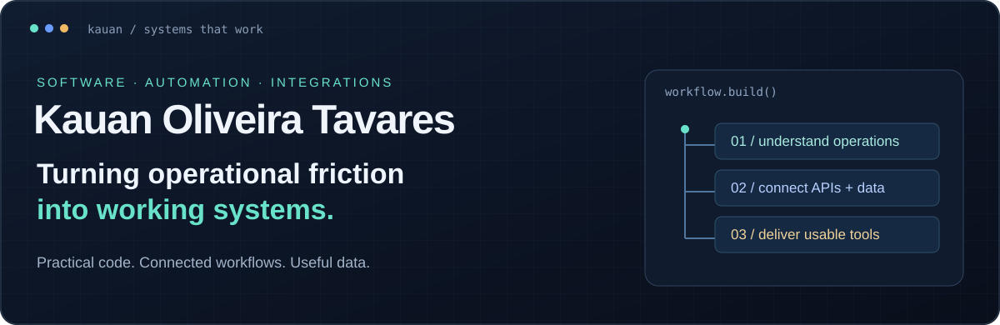
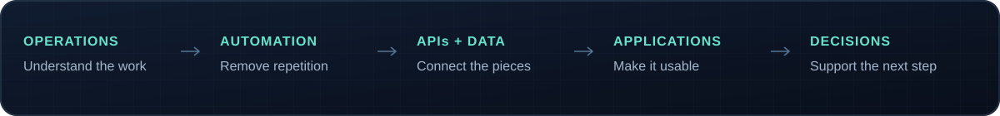

**Software developer working at the intersection of business operations and code.**

I turn spreadsheets, repetitive tasks, and disconnected tools into applications people can use.

[Portfolio](https://kauantavares.netlify.app/) &nbsp; · &nbsp; [LinkedIn](https://www.linkedin.com/in/kauan-tavares49) &nbsp; · &nbsp; [Email](mailto:kauanotavares@gmail.com)

### From a workflow to a working system

I start with the process: what people do, where the work gets stuck, and which systems need to talk. Then I build the interface, integration, or data tool that makes the next step easier.

### Selected work

Explore the source, setup instructions, and documented limitations in each repository.

<table>
<tr>
<td width="50%"></td>
<td width="50%"></td>
</tr>
<tr>
<td width="50%"></td>
<td width="50%"></td>
</tr>
<tr>
<td width="50%"></td>
<td width="50%"></td>
</tr>
</table>

### My building blocks

| Area | Tools used in my repositories |
| :--- | :--- |
| **Languages** | Python · TypeScript · JavaScript · SQL |
| **Web applications** | React · Next.js · NestJS · Express · Vite |
| **Desktop & automation** | Flet · PyQt5 · Tkinter · Selenium |
| **Data & storage** | Pandas · OpenPyXL · PostgreSQL · MySQL · SQLite · Supabase · Prisma |
| **Delivery** | Git · Docker · environment-based configuration |

### The way I work

**Understand first.** Map the workflow and make the assumptions visible.  
**Build something useful.** Connect the interface, the business rules, and the data.  
**Keep the handoff clear.** Document setup, prerequisites, and the limits of the implementation.

**Have a workflow that should be simpler?**  
[Let's talk](mailto:kauanotavares@gmail.com) · [Explore all repositories](https://github.com/KauannOliver?tab=repositories)

